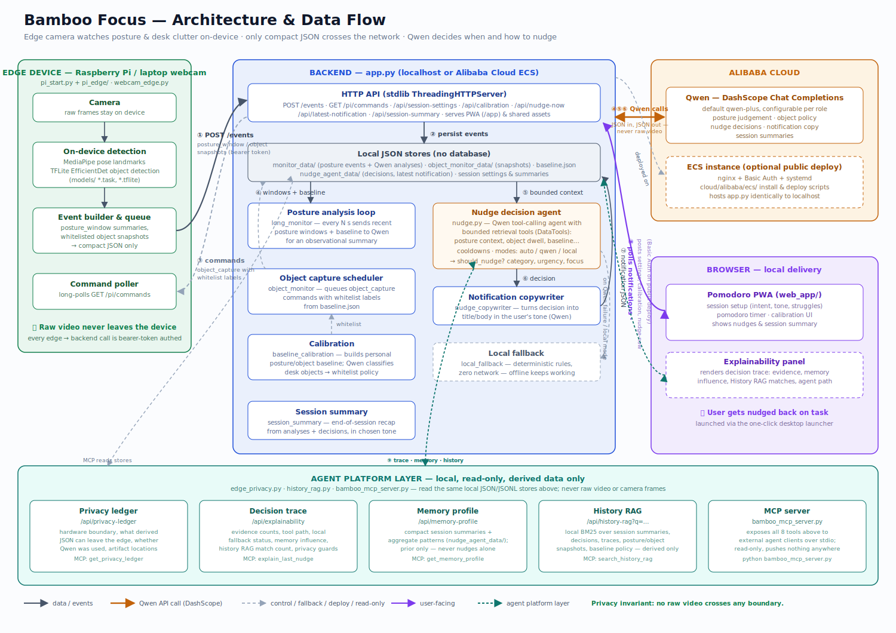

# Bamboo Focus

A Qwen-powered focus coach for ADHD workflows. A camera — a laptop webcam or a Raspberry Pi — watches posture and desk clutter *on-device*, sends only compact JSON events (never raw video) to a backend, and a Qwen-driven agent decides when and how to nudge you back on task.

**Hackathon track:** Track 5 — EdgeAgent

This README is a step-by-step guide to get it running. For the architecture/design writeup, see [Architecture](#architecture) below.

## 1. Prerequisites

- Python 3.11+
- A webcam (laptop cam is fine) — or a Raspberry Pi with a camera if you want the real edge-device setup
- A Qwen API key from [Alibaba Cloud Model Studio / DashScope](https://dashscope-intl.aliyuncs.com) (optional — the app runs in `local` nudge mode without one, using rule-based nudging instead of Qwen)

## 2. Install

```bash
python -m venv venv
venv\Scripts\activate          # Windows. On macOS/Linux: source venv/bin/activate
pip install httpx opencv-python mediapipe
```

`app.py` itself is stdlib-only — `httpx`, `opencv-python`, and `mediapipe` are only needed for the webcam/Pi edge process.

## 3. Configure

Create a `.env` file in the repo root (already gitignored):

```
QWEN_API_BASE=https://dashscope-intl.aliyuncs.com/compatible-mode/v1
QWEN_API_KEY=sk-...your-key...
QWEN_MODEL=qwen3.7-max
```

Skip this step if you just want to try it with `--nudge-mode local` (no Qwen calls).

## 4. Run it locally (one machine, webcam)

Start the backend + Pomodoro PWA:

```bash
BambooFlow.bat                  # Windows, double-click or run from a terminal
# or, cross-platform:
python bamboo_flow_launcher.py
```

This starts `app.py` on `http://127.0.0.1:8000` and opens the PWA in your browser. The console output prints the bearer `TOKEN` to use next — copy it.

In a second terminal, start the webcam edge process pointed at that backend:

```bash
python webcam_edge.py --laptop-api-base http://127.0.0.1:8000 --token <TOKEN> --download-object-model --download-pose-model --debug-stream
```

First run downloads the MediaPipe pose/object models into `models/`. Once it's streaming, go to the PWA in your browser, hit **Calibrate**, sit at your normal desk posture for the calibration window, and you're live — posture/object events start flowing and the nudge agent starts deciding when to interrupt you.

Want to skip Qwen entirely and just test the rule-based fallback? Add `--local` (or `--nudge-mode local`) when starting `app.py`:

```bash
python bamboo_flow_launcher.py --local
```

## 5. Run it on a Raspberry Pi (real edge device)

On the laptop/server, start `app.py` as in step 4 and note its LAN IP (printed as `Pi API base`).

On the Pi:

```bash
python pi_start.py --laptop-api-base http://<laptop-ip>:8000 --token <TOKEN> --download-object-model --download-pose-model
```

`pi_start.py` installs/launches the same pose+object pipeline as `webcam_edge.py`, using the Pi's camera instead.

## 6. Deploy publicly (Alibaba Cloud ECS)

For a public demo instead of localhost, provision an ECS instance and run:

```powershell
.\cloud\alibaba\ecs\deploy_to_ecs.ps1 -PublicIp <PUBLIC_IP> -FlowPilotToken "<TOKEN>" -BasicAuthUser "hackathon" -BasicAuthPassword "<PASSWORD>" -QwenApiKey "sk-..."
```

This runs [`cloud/alibaba/ecs/install_bamboo_flow_ecs.sh`](cloud/alibaba/ecs/install_bamboo_flow_ecs.sh) on the box, which installs nginx + a systemd service and puts the whole app behind HTTP Basic Auth (required — without it, `/app/` and every `/api/*` route, including the one handing out the bearer token, is open to the internet).

Then point `webcam_edge.py` or `pi_start.py` at `http://<PUBLIC_IP>` instead of a LAN address.

## Repo layout

| Path | What it is |
| --- | --- |
| `app.py` | Unified backend: HTTP API, event storage, orchestration of posture analysis + nudge agent + session summaries. Runs identically on localhost or Alibaba Cloud ECS. |
| `pi_start.py`, `pi_edge/` | Raspberry Pi edge process: local pose/object detection, posts events to the backend. |
| `webcam_edge.py` | Laptop-webcam equivalent of the Pi edge process, for running without a physical Pi. |
| `baseline_calibration.py`, `laptop_calibration_server.py` | Calibration flow that builds a personal posture/object baseline (uses Qwen to classify detected objects). |
| `nudge.py`, `local_fallback.py`, `nudge_copywriter.py` | The nudge decision agent (Qwen tool-calling agent), its offline rule-based fallback, and notification copywriting. |
| `long_monitor.py`, `object_monitor.py` | Posture and object event receivers/schedulers. |
| `session_summary.py` | End-of-session summary generation. |
| `web_app/` | Pomodoro PWA served by `app.py`. |
| `bamboo_flow_launcher.py`, `BambooFlow.bat` | One-click local desktop launcher (starts `app.py`, opens the PWA). |
| `cloud/alibaba/` | Alibaba Cloud ECS deployment: `ecs/deploy_to_ecs.ps1`, `ecs/install_bamboo_flow_ecs.sh`. |

## Architecture



No raw video crosses the Edge → Backend or Backend → Cloud boundary at any point.

## EdgeAgent privacy-first agent platform

This branch adds a local agent-platform layer around the existing edge loop:

- **Privacy ledger:** `/api/privacy-ledger` records the hardware boundary, what derived JSON can leave the edge, whether Qwen was used for the latest decision, and where local runtime artifacts live.
- **Decision trace:** `/api/explainability` explains the latest nudge decision, including evidence counts, tool path, local fallback status, and privacy guards.
- **Compact agent memory:** `/api/memory-profile` stores only session-level summaries and aggregate patterns under `nudge_agent_data/`; it excludes raw video, frames, and full sensor streams.
- **Read-only MCP server:** `bamboo_mcp_server.py` exposes local tools for agent clients without pushing data anywhere.

Run the MCP server locally:

```bash
python bamboo_mcp_server.py --nudge-mode auto
```

Available MCP tools include:

- `get_current_focus_state`
- `get_recent_posture_summary`
- `get_object_dwell_report`
- `get_recent_nudge_history`
- `explain_last_nudge`
- `get_privacy_ledger`
- `get_memory_profile`

The MCP server is intentionally read-only. It reads local JSON/JSONL artifacts and exposes compact edge-derived summaries, not camera frames or raw video.

### Why this fits EdgeAgent

- **Perceives via edge sensors:** pose landmarks and object detection run locally on the Pi/laptop (MediaPipe + a TFLite object detector). Only derived JSON (posture window summaries, whitelisted object labels) ever leaves the device.
- **Reasons via cloud APIs:** the backend periodically sends posture summaries and calibration data to Qwen (Alibaba Cloud DashScope) for observational judgement, object-policy classification, nudge decisions, and notification copywriting.
- **Acts locally:** nudges/notifications are delivered through the local Pomodoro PWA, not routed back through the cloud.
- **Graceful degradation:** `--nudge-mode local` (see `local_fallback.py`) runs deterministic rule-based nudging with zero network/model calls, so the loop keeps working offline or on a weak connection. `auto` mode tries Qwen first and falls back to local rules on failure.
- **Privacy-aware:** camera frames never leave the edge device. Only structured posture/object events cross the network, every edge→backend call is bearer-token authenticated, and the UI now exposes a privacy ledger plus per-decision trace for auditability.

## Proof of Alibaba Cloud deployment

- Deployment code: [`cloud/alibaba/ecs/install_bamboo_flow_ecs.sh`](cloud/alibaba/ecs/install_bamboo_flow_ecs.sh) provisions the ECS instance (nginx, systemd service, Basic Auth).
- Alibaba Cloud API usage: `QWEN_API_BASE` calls hit `https://dashscope-intl.aliyuncs.com/compatible-mode/v1` (Alibaba Cloud Model Studio/DashScope) — see `nudge.py`, `long_monitor.py`, `baseline_calibration.py`.
- Deployment recording: `<TODO — add link once recorded>`

## Demo video

`<TODO — add public YouTube/Vimeo/Facebook link>`

## License

MIT — see [`LICENSE`](LICENSE).
